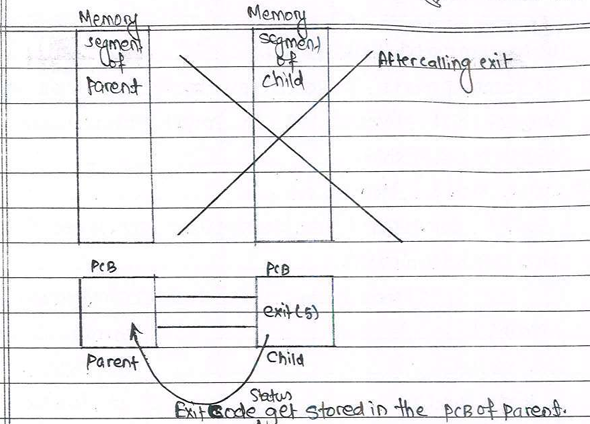
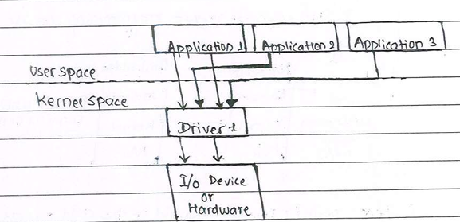

# Process Management Subsystem


Process Management Subsystem

## Process:   The Process is nothing but the program running in user space of RAM

gcc filename.c  a.out  execute

--> a.out file is stored in the hard-disk, when it is executed it get loaded into the RAM. The memory segment get loaded into the user space and the PCB of the program or process get loaded into the kernel.

                                                                  (OR)

--> Whenever a program comes into execution the contents of executable binary (a.out) copied from hard-disk to user space of RAM.

### The RAM is divided into two parts:

1. User Space of RAM --> Upper part of RAM

2. Kernel Space of RAM --> Lower part of RAM

-->Whenever the program loaded into RAM , Two more memory segments are added. Those are Heap & Stack Segments.

PCB: For every process we create a block of information in kernel space of RAM is known as Process Control Block or Process Descriptor


### PCB contains:


**1. Process Identifier(PID)**

**2. Parent Process Identifier(PPID)**

    Every Process is created from another process that another process is called Parent process.

**3. File Descriptor Table(FD table)**

      It contains information about the file that are being opened by the programmer. There are many files in kernel but it does not maintains all the information of these files.

**4. Signal Disposition Table/Signal Disposition/Disposition of Signal/Signal behaviour table**

When we are hanging in the infinite loop, then we press the key to come out of the loop
i.e.
Ctrl + C ⇒ Termination
Ctrl + Z ⇒ Suspend

These combinations when used in kernel space generate the signal.

Improper handling of pointers causes crash during runtime of execution and program crashes with segmentation fault. Then this process is aborted using signaling mechanism.

**5. Page Table**

For understanding requires virtual memory and further requires paging technique and address translation.

## Process: Memory segment in user space and PCB in kernel space collectively called as process.

Process = Memory segment in user space + PCB in kernel space

## Note:
There are many process in the system, every process have their own memoery segment and they have correspondig PCB in kernel space.

  text segment= Contains Machine instruction corresponding to compiled program.
  BSS segment=Block started by symbol used to store the uninitialized global vatiables.
  Data Segment= Data segment is used to store the initialized global variables and intitalized static local variables
  


## Process Creation:

There are two ways to create a Process

1. By using commands
2. By using fork() System call

### **1. By using commands**

&rarr; From the executable file process can be created by using command __./a.out__ where a.out is the executable file obtained after compilation.


### **2. By using fork() System calls**

### System call: 
It is used in user space to send the resuest to the sub-system in kernel space. Every system call has an equivalent call in kernal space which starts with **sys_**.

&rarr; fork() system call can be used to create a child process and the process from where the fork() is invoked is called the parent process.

&rarr; Once we call fork() control immediately jumps to kernel space invoking an equivalent function in kernel starting with sys_. ofrk() is actually sending request to kernel space subsystem.

        (or)

&rarr;When we call fork() we are sending request to process management subsystem present in kernel space.(i.e, Kernel space process management)

__NOTE : -__

A Process which invoke fork system call is called **parent proccess** and the new process get created is called **child process**.


&rarr;Thus Page table and fd table of parent process get copied to the child process.

&rarr; parent and child process are execute different block of code.

&rarr;Before fork() invokation there is only one process but after fork() invokation there are two process i.e, child process and parent process.

&rarr;By using the conditional statement after fork(), we ensure that parent process and child process will execute different block of codes. If conditional statements are not present then parent and child process will execute same block of code.


&rarr;To this conditional statement we pass return value of fork().

%20execution.png)

Form the above child process execution is not going to start from the main function() it start after the fork().

&rarr;__fork() returns twice once in parent process and once in child process__

- fork() returns pid of child process in parent process
- fork() return "0" in the child process.

## Orphan Process and Demon Process(Zombie Process)

- ## Orphan Process

  - If parent process terminates even before child process is called orphan process.
  
  Ex:   main(){
    id=fork();
    
    if(id==0){
      sleep(60);
    
    }
    
    else {
      
    sleep(30);
    
    }
  
  }

  &rarr; Once the main function terminates then the parent process will be terminated. The memory segment and PCB get loaded from user space and kernel space respectively.

  &rarr; The PPID of the orphan process is '1', it takes PID of the init process. Init process is the first process od OS boot.

  __Exit Vs return__

  &rarr; The returns takes return to the locatipn where function is invoked. Where as exit terminates the entire function.

  

&rarr;
The kernel by default submit the status of child process to parent process and it is done by using command __wait(&stat)__.

&rarr; By using wait() we can get the exit code of child process in parent process.

&rarr; wait() is a "blocking call".

&rarr; wait() comes out of the blocking state only when the child process get terminates.

.png)

&rarr; Inside the child process wait() should not be executed so it is necessary to use exit().

__Note :__ When the exit is called then process is removed, i.e, removed means memory segment get eliminated and exit status get stored in PCB, after submitting the PCB exit status to parent PCB in kernel space, the child PCB get destroyed.



&rarr; If no wait() was there then we cannot get access to exit status of child process. Althrough the memory segments will be erased but PCB content will be then on calling exit(5);
&rarr;Using command ps -af we can be able to see the child process.

- ## Zombie process or Demon process

  - parent process dies but still has entry in the process table is called __Zombie process__ or defunt process or Demon process.

  - Process can be terminated by using the command "kill"   [kill -g pid of the process]
  
  - But Zombie process can be terminated by using "kill" command because memory segment of child process has be erased so no process because of no any instruction set.

  

  - The exit code of the child process is passed to argument of wait() in parent process

  - To extract the exit code, which is present in second byte od variable 

  `````
  WEXITSTATUS(stat);
  ```````` 

  &rarr; WEXITSTATUS(stat) is a predefined macro which extract 1 byte of exit code from the 4 byte variable.

- ## fork() system call

  - Driver can never initiate I/O request. Application can initiate I/O request

  - One driver can access a single device if the devices are same in nature then one driver can access those I/O devices also. When more than one drivers interact woith single I/O devices there arises improper functioning.

  - We can not have multiple drivers accessing single device

  - we can have multiple applications sending request to single driver.

  - Application sends an request to drivers by using system call.

  - Hardware/Device can initiate a request by using __" Hardware interrupts"__

  

  __Note :__

    - There are specific group of system calls used to send request to driver from application those are called __"Basic I/O calls"__.

  ### Use of fork()
    
    1. To create multiple applications from single application.
    
    2. Shell program internally uses fork() + exec() family system call.

    3. In client and server progrmming we use fork() system call

  __Note :__

    - wait() returns the pid of the child process that haas been terminated.

                        pid=wait(&stat);

  - 1 byte exit code comming from child process. Remaining 3 bytes contain the information about normal/abnormal termination of the child process. In case of abnormal termination the signal used to terminate the specific child process is specified.

  __Q) What are the variants of wait system call?__

    1. wait() : blocks until child process terminates.

    2. waitpid() : Basical;y it takes three arguments and it comes to unblocking state when any specific child process terminates.

  __Note :__

    - vfork() is always combined with the exec() family of calls. to understand vfork() we need to understand the virtual memory which requires furthur concept of pageing technique and address tranlation.
  __why do not we run progrm with in hard disk (or) why do we copy progrm to RAM for execurion.__

    1. Accesing a data present in hard-disk is slower mechanism compared to RAM

    2. Data can be accessed from hard-disk block-by-block, where as from RAM we can access byte-by-byte.

    

    - Memory in CPU in the form of register and we use register name to refer to the CPU register.

    - Basic units of memory are bit and bytes.

    - RAM are divided into byte by byte location or RAM. Memory are splitted into byte by byte memory locations and we use pointer yo store the address of RAM

    - To copy the data from RAM to CPU we are using CPU instructions __"LDA"__(load);

    -  To copy the data from CPU to RAM we are using CPU instruction __"STR"__(store).
## Virtual Memory
- Suppose we have four process already loaded into RAM and we want to load one more process.

     
  
  <u><b><big>Posibilities:</big></b></u>

    1. wait until one of the process terminates.
      
        - Actually we do not know the how much time takes a process to terminate.It depends upon processor. so not possible
    2. Terminates one of the process in between

        - For termination of process in between we need to have problem in the code. Again not possible
    3. Try to findout segment of these process which are not used longer duration of time

       - Yes, it can be done

    &rarr; In order to findout the segments which are not used for longer duration of in a process we need to follow some alogorithm.

    - Step-1: Hard disk is consist of two segments i.e, __"Swap area"__ in Linux and __"Banking storage"__ in windows and memory segments of process which are not used for longer duration we move to swap area of hard disk.

  __Note :__
     
     - It is not mendatory to have all segments in RAM for eecution. Some of the process segments may be there in swap area and still we can execute the process.

       
    - The empty spaces that has been generated are not continuous memory location. It is because some of the memory segment of process which does not last for longer duration of time has been copy to swap area of hard disk.

    - Since we have empty spaces load the new process, for that new process segments has to be splitted and load to nin-continuous or empty memory locations of RAM.
  
  __Note :__

    - To run a program, memory segments need not be continuous memory locations. It also can be uncontinuous memory locations.

    __Problems :__

    1. Keep track of segments of process copied to the swap area of hard disk.

    2. Also keep track of segments of new process which are present in uncontinuous memory locations.

  &rarr; To overcome these two problems we use __"Pagening Techniques"__. 


    
    